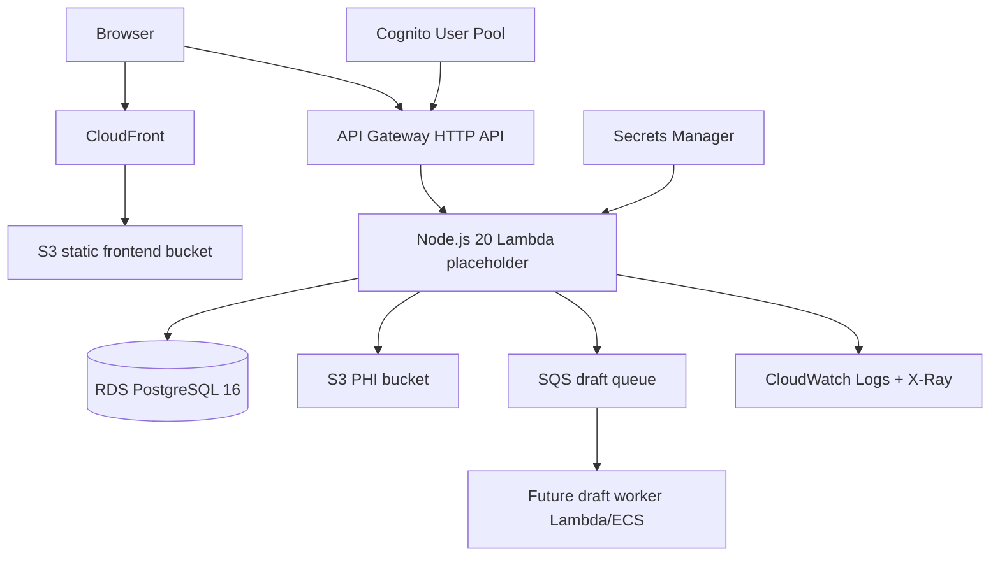

# Compact EMR

Phase 0 scaffold for the Compact EMR: an AWS-native, HIPAA-first internal workflow application for Flat Rate Nexus.

## Status

This repo currently contains Phase 0 only:

- npm workspaces for `frontend/`, `backend/`, and `infra/`
- AWS CDK TypeScript app with foundational stacks
- Docker Compose local baseline for Postgres, LocalStack, and Cognito stub
- GitHub Actions CI/CD skeleton using GitHub OIDC
- Deployment documentation

No production data model, API routes, UI pages, or CDS logic are implemented in Phase 0.

## One-command local services

```bash
docker compose up
```

This starts:

- Postgres 16 on `localhost:5432`
- LocalStack on `localhost:4566`
- Cognito-local on `localhost:9229`

Copy `.env.example` to `.env` for local development:

```bash
cp .env.example .env
```

## Install dependencies

```bash
npm install
```

## Run frontend placeholder

```bash
npm run dev:frontend
```

## Run backend placeholder

```bash
npm run dev:backend
```

## Validate the repo

```bash
npm run lint
npm run typecheck
npm test
npm run cdk:synth:staging
```

## Architecture



## Brief

The product brief should live at:

```text
docs/COMPACT_EMR_BRIEF.md
```

For this scaffold, the brief is represented by `docs/COMPACT_EMR_BRIEF.md` as a placeholder. Replace it with the source brief before Phase 1.

## Phase 1 local database/auth commands

```bash
cp .env.example .env
docker compose up -d postgres localstack cognito-local
npm run db:generate
npm run db:migrate
npm run db:seed
npm test -w backend
```

Protected health endpoint local smoke test:

```bash
cd backend
AUTH_TEST_JWT_SECRET=phase1-local-secret AUTH_TEST_ISSUER=compact-emr-local AUTH_TEST_AUDIENCE=compact-emr-api npm run dev
# In another shell, generate an HS256 test token or use the fixture in docs/verification/phase1-evidence/curl-200.txt.
```

Phase 1 details are in `docs/PHASE1_NOTES.md`.
